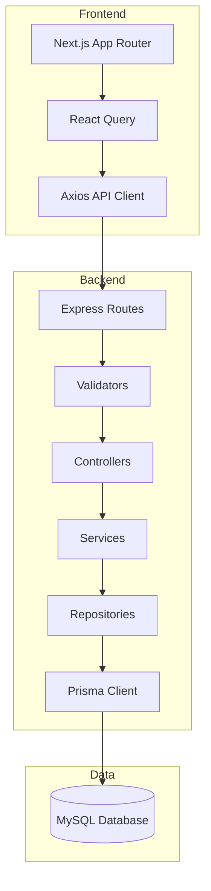

# EventHub - Project Overview

## Introduction
EventHub is a robust, full-stack event management and ticket booking application designed specifically for QA training and test automation practice. It provides a realistic environment where users can manage the entire lifecycle of an event, from creation to ticket booking and cancellation.

The application is architected to support isolated user sandboxes, ensuring that training activities do not interfere with each other.

## Core Features
- **Event Discovery**: Browse and filter events by category (Conference, Concert, Sports, Workshop, Festival) and city.
- **Search**: Full-text search across event titles, descriptions, and venues.
- **Booking System**: Real-time seat management with atomic transactions to prevent overbooking.
- **User Profiles**: Personal dashboard to manage bookings and user-created events.
- **Admin Capabilities**: Create, update, and delete events (restricted for static seeded data).
- **Automated Testing Support**: Optimized with `data-testid` attributes for reliable E2E testing using Playwright.

## Technology Stack

### Frontend
- **Framework**: Next.js 14 (App Router)
- **State Management**: React Query v5 (TanStack Query) for server state.
- **Styling**: Tailwind CSS for responsive and modern UI.
- **Language**: TypeScript for type-safe development.
- **API Client**: Axios with interceptors for auth and error handling.

### Backend
- **Runtime**: Node.js
- **Framework**: Express.js
- **ORM**: Prisma ORM for type-safe database access.
- **Database**: MySQL 8+
- **Documentation**: Swagger/OpenAPI (available at `/api/docs`).
- **Authentication**: JWT (JSON Web Tokens) with bcryptjs for password hashing.

### Testing
- **Framework**: Playwright
- **Capabilities**: E2E testing on Chromium, UI mode, and CI integration.

## System Architecture
The project follows a clean, layered architecture to separate concerns and ensure maintainability:

## Domain Models

### User
- `email`: Unique identifier.
- `password`: Hashed using bcrypt.
- Relationships: Owns multiple `Events` and `Bookings`.

### Event
- `title`, `description`, `category`, `venue`, `city`, `eventDate`.
- `price`: Decimal.
- `totalSeats`: Capacity.
- `availableSeats`: Remaining tickets (auto-updated).
- `isStatic`: Flag for protected, seeded data.

### Booking
- `customerName`, `customerEmail`, `customerPhone`.
- `quantity`: Number of tickets.
- `totalPrice`: Calculated at booking time.
- `bookingRef`: Unique 10-character reference (e.g., `EVT-A3B2C1`).
- `status`: Defaults to `confirmed`.

## Key Business Rules

1. **Isolated Sandboxes**: Every user operates within their own data scope for user-created events and bookings.
2. **Resource Limits**: 
   - Maximum of **6 user-created events** per account.
   - Maximum of **9 bookings** per account.
   - System uses FIFO (First-In, First-Out) pruning when these limits are exceeded.
3. **Booking Logic**:
   - Seat count reduces immediately upon booking.
   - Seat count is restored if a booking is cancelled.
   - The first character of the `bookingRef` matches the first character of the event title (uppercase).
4. **Refund Eligibility**:
   - Bookings for **1 ticket** are eligible for a refund (client-side logic).
   - Bookings for **more than 1 ticket** are NOT eligible.
5. **Data Protection**: Seeded events (where `isStatic: true`) cannot be edited or deleted by users.

## Development Workflow
- **Prerequisites**: Node.js 18+, MySQL 8+.
- **Setup**: `npm run setup` installs all dependencies.
- **Database**: `npm run db:push` to sync schema; `npm run seed` to populate initial data.
- **Running**: `npm run dev` starts both frontend and backend concurrently.
- **Testing**: `npm run test` executes the Playwright suite.
